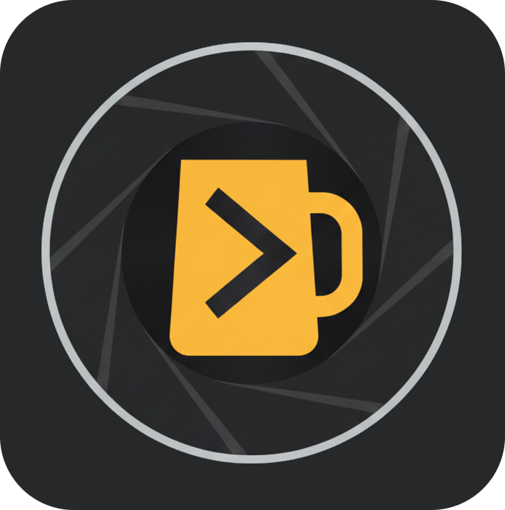
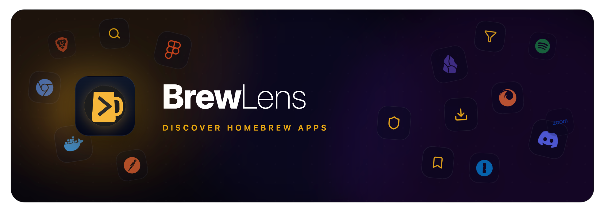

  <h1>
  <strong>Brew</strong>Lens</h1>
  
<strong>A modern, web-based explorer for Homebrew Casks and Formulae.</strong>

  

    <a href="https://amit9838.github.io/brewlens/">Website</a>
    ·
    <a href="https://github.com/amit9838/brewlens/issues">Report Bug</a>
    ·
    <a href="https://github.com/amit9838/brewlens/issues">Request Feature</a>
  

  

  <!-- You can add badges here later, e.g., for GitHub stars, license, etc. -->
  
  

 

## ✨ What is BrewLens?

BrewLens is a modern browser-based tool that fetches and parses **Homebrew Cask and Formula** metadata directly from official Homebrew sources. It helps developers and power users inspect application and command-line tool details with clarity and speed — **all without using a single terminal command.**

You can browse both **Casks (macOS Apps)** and **Formulae (CLI Tools)** , with a rich set of features:

- **Comprehensive package details** – version info, installation commands, homepages, download URLs, SHA256 checksums, dependencies, artifacts (for casks), deprecation/disable status, and full JSON representation.
- **Bookmarks & Recents** – save packages for quick access and revisit your recently viewed items.
- **Dashboard** – an overview of your installed, bookmarked, and recently viewed packages.
- **Brewfile Support** – import and export Brewfiles to manage your package setup.
- **Analytics Page** – view aggregated usage statistics and insights.
- **Quick Search** – instantly find casks or formulae with a keyboard-first search experience.
- **Pagination** – navigate long lists efficiently with intuitive page controls.
- **Jump Index** – quickly skip to a specific letter in the package list.
- **Blurred Background Cards** – optional visual enhancement for a modern, polished look.

## 🎯 Who is it For?

- **Developers:** Inspect metadata, versions, URLs, and dependencies while building or debugging casks and formulae.
- **Security / Compliance Teams:** Quickly verify download URLs, SHA256 checksums, and source authenticity for any package.
- **SysAdmins:** Audit applications and tools before deploying to managed macOS or Linux environments.
- **Homebrew Contributors:** Easily investigate cask or formula structure before making pull requests.
- **General Users:** Discover new macOS apps and command-line tools available via Homebrew without ever opening the Terminal.

## 📝 License

Distributed under the MIT License. See `LICENSE` file for more information.

## 📬 Thanks to

[Homebrew](https://docs.brew.sh/)

---

Made with ❤️ for the Homebrew community

<!-- MARKDOWN LINKS & IMAGES -->
[React.js]: https://img.shields.io/badge/React-20232A?style=for-the-badge&logo=react&logoColor=61DAFB
[React-url]: https://reactjs.org/
[TypeScript]: https://img.shields.io/badge/TypeScript-007ACC?style=for-the-badge&logo=typescript&logoColor=white
[TypeScript-url]: https://www.typescriptlang.org/
[Vite]: https://img.shields.io/badge/Vite-646CFF?style=for-the-badge&logo=vite&logoColor=white
[Vite-url]: https://vitejs.dev/
[MUI]: https://img.shields.io/badge/Material--UI-0081CB?style=for-the-badge&logo=mui&logoColor=white
[MUI-url]: https://mui.com/

