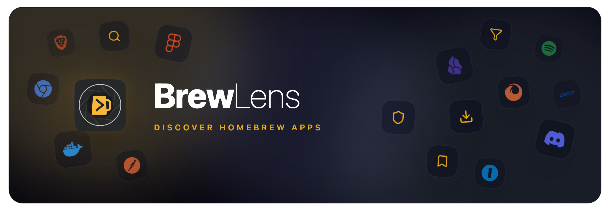
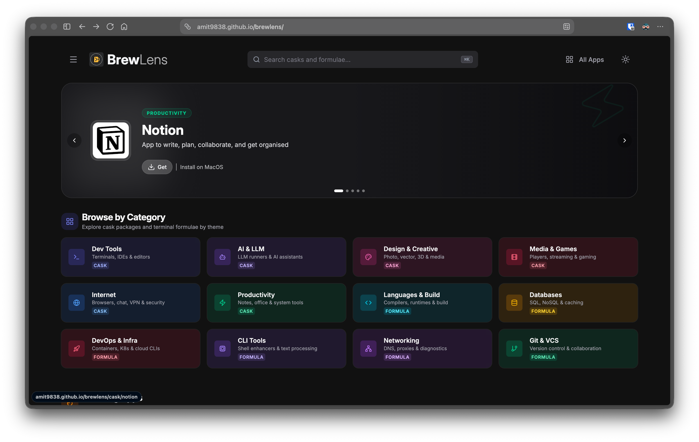

<div align="center">
  <a href="https://amit9838.github.io/brewlens/" title="Visit Website" target="_blank" rel="noopener noreferrer">
    
  </a>

  <h1><strong>Brew</strong>Lens</h1>
  <p><strong>The missing visual interface for Homebrew.</strong></p>
  <p>Browse, search, and inspect every cask and formula — right in your browser, no terminal required.</p>

  <p>
    <a href="https://amit9838.github.io/brewlens/">Website</a>
    ·
    <a href="https://amit9838.github.io/brewlens/installation">Installation Guide</a>
    ·
    <a href="https://github.com/amit9838/brewlens/issues">Report Bug</a>
    ·
    <a href="https://github.com/amit9838/brewlens/issues">Request Feature</a>
  </p>

  <a href="LICENSE"></a>
  
  
  <br/>
  
  
</div>

<br>

Homebrew is brilliant — but `brew search` and formula pages weren't built for browsing. BrewLens turns the entire Homebrew ecosystem into a fast, searchable app store: trending apps, rich package details, checksums for auditing, and one-click install commands you can copy and run yourself.



## Features

**Discover**
- Instant, keyboard-first search across every cask and formula
- Category browsing — dev tools, AI & LLM, design, databases, networking, and more
- Trending apps ranked by Homebrew's official 30-day install analytics
- Step-by-step [installation guide](https://amit9838.github.io/brewlens/installation) for macOS, Linux, and Windows (WSL)

**Inspect**
- Version, description, homepage, and the exact `brew install` command for every package
- Download URLs, SHA-256 checksums, dependencies, and cask artifacts
- Deprecation/disable status plus the full raw JSON for power users

**Manage**
- Bookmarks and recently viewed history, stored locally in your browser
- Brewfile import and export to reproduce your setup anywhere
- Dark mode, responsive layout, and clean shareable URLs

## Explore the Site

| Page | What you'll find |
| --- | --- |
| [Home](https://amit9838.github.io/brewlens/) | Dashboard — trending apps, editor's picks, your shelf |
| [Explorer](https://amit9838.github.io/brewlens/all) | Every cask and formula with search, filters, and a jump index |
| [Installation Guide](https://amit9838.github.io/brewlens/installation) | Copy-paste Homebrew setup, platform by platform |
| [Analytics](https://amit9838.github.io/brewlens/analytics) | Most-installed packages over 30, 90, and 365 days |
| [About](https://amit9838.github.io/brewlens/about) | The project, its data sources, and how to contribute |

## Who it's For

Developers debugging casks and formulae, security teams verifying checksums and download URLs, sysadmins auditing packages before deployment, Homebrew contributors reviewing structure before a PR — and anyone who'd rather discover great macOS apps without opening a terminal.

## Built With

<p>
  
  
  
  
  <br/>
  
  
  
  
</p>

## Getting Started

> **Prerequisite:** [Node.js](https://nodejs.org) ≥ 20.19 (required by Vite 7)

```bash
git clone https://github.com/amit9838/brewlens.git
cd brewlens
npm install
npm run dev
```

Then open `http://localhost:5173/brewlens/`. For the project layout and guidelines, see [CONTRIBUTING.md](CONTRIBUTING.md).

| Command | Description |
| --- | --- |
| `npm run dev` | Start the dev server with hot reload |
| `npm run build` | Type-check and build for production (`dist/`) |
| `npm run preview` | Serve the production build locally |
| `npm run lint` | Run ESLint over the codebase |
| `npm run deploy` | Build and publish to GitHub Pages |

## Deployment

BrewLens deploys to GitHub Pages from `dist/` via [`gh-pages`](https://github.com/tschaub/gh-pages):

```bash
npm run deploy
```

The app is hosted under a sub-path (`/brewlens/`). Deep links like `/brewlens/installation` are handled by a `public/404.html` SPA fallback that stashes the requested URL and hands it back to the router — no server configuration needed.

## Data & Privacy

- All package metadata and analytics come client-side from the official [Homebrew API](https://formulae.brew.sh). BrewLens is **read-only** — it never installs or modifies anything on your machine.
- Bookmarks, history, and theme preference live in **your browser's local storage**. No accounts, no tracking.

## Contributing

Bug reports, feature ideas, and pull requests are all welcome. Start with [CONTRIBUTING.md](CONTRIBUTING.md), then check [open issues](https://github.com/amit9838/brewlens/issues).

## License

Distributed under the MIT License — see [`LICENSE`](LICENSE).

## Acknowledgements

- [Homebrew](https://docs.brew.sh/) — the package manager that makes this all possible
- [lucide](https://lucide.dev/) and [Shields.io](https://shields.io/) — icons and badges

---

<p align="center">Made with ❤️ for the Homebrew community</p>
